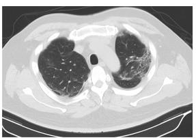

# COVID-19-Classifier-based-on-CT-Scans
A CNN classifier implemented using Tensorflow and Keras

Refer the IPython notebook in the repository for the full analysis.

The model which was used for this classifier was DenseNet121.

Dataset used: https://github.com/UCSD-AI4H/COVID-CT
